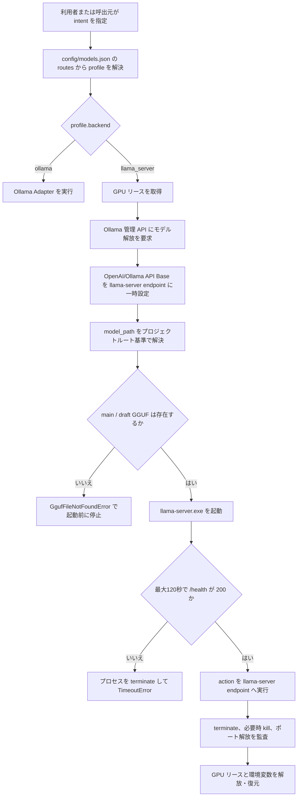

# フロー解析: GGUFモデル運用と llama-server 起動

## メタ情報

| 項目         | 内容                                                                                              |
| ------------ | ------------------------------------------------------------------------------------------------- |
| 解析日       | 2026-09-07                                                                                        |
| 対象         | GGUF 配置、設定、バックエンド選択、llama-server 起動・終了                                        |
| 判定レイヤー | L3（複数モジュール）                                                                              |
| Confidence   | High                                                                                              |
| 結論         | GGUF の配置・パス解決・存在検証は設計済みだが、利用開始から復旧までの具体的な運用フローは未記載。 |

## 対象解決

`GGUF`、`model_path`、`llama_server` を検索し、以下を対象とした。

- `config/models.json`
- `tools/config_loader.py`
- `tools/backend_coordinator.py`
- `tools/llama_backend.py`
- `tools/gguf_manager.py`
- `docs/design/SBOS-DD-005_Backend_GPUリース仕様.md`

## 実装されている処理フロー

1. `BackendExecutionCoordinator.execute()` が `intent` を profile に解決し、GPU リースを取得する。
2. `llama_server` profile では、Ollama 側のモデル解放を試みる。Ollama API に接続できなくても llama-server 起動は継続する。
3. `managed_llama_server()` は main と draft の GGUF パスを検証し、相対パスをプロジェクトルートから解決する。
4. GGUF が存在する場合だけ `llama-server.exe` を起動し、`/health` が成功した後に action を実行する。
5. action の終了後は llama-server を終了し、ポート解放を確認してから GPU リースを解放する。

## 現在の設定における到達性

`reasoning_economy` は `llama_server` profile として定義されているが、現在の全 intent route は `reasoning_ollama` または `coding_ollama` を指す。そのため、設定を変更しない限り上記の GGUF / llama-server フローは通常実行されない。

## 文書化済みの範囲

`SBOS-DD-005_Backend_GPUリース仕様.md` は、次を記載している。

- `./models/` を GGUF の標準配置先とすること
- `model_path` の相対・絶対パス解決と、起動前の存在検証
- GGUF 不在時に早期失敗すること
- GPU 排他、Ollama の解放、llama-server の起動という設計方針
- 設定変更を反映するには新しい Python プロセスが必要なこと

これはコンポーネント仕様としては十分だが、利用者が実行する順序・判断基準・復旧方法を示す手順書ではない。

## 未文書化の具体的フロー

### 1. GGUF の配備・有効化フロー

以下がないため、利用者は llama-server を実運用で有効化できない。

1. GGUF の取得元、ライセンス、量子化方式、ハッシュを確認する。
2. main GGUF と draft GGUF の組合せ・互換性を確認する。
3. `models/` へ配置し、容量・読み取り権限を確認する。
4. `config/models.json` の `model_path` を設定する。
5. 対象 intent の route を `reasoning_economy` に切り替える。
6. 新しい Python プロセスで設定を再読込する。
7. llama-server の health、推論結果、GPU・ポート解放を確認する。
8. 失敗時は route を Ollama profile へ戻して再起動する。

### 2. draft GGUF の設定フロー

設計書は `draft_model_path` を参照する一方、`ProfileConfig` と Coordinator は main の `model_path` しか受け渡さない。現実装では `managed_llama_server()` の既定値 `./models/mtp-gemma-4-12B-it.gguf` が draft として検証・起動引数に使われる。

そのため、次を仕様として決める必要がある。

- draft モデルを profile 設定として明示するか
- speculative decoding を無効化できるようにするか
- main / draft の対応関係をどこで検証するか
- モデル更新時に両方をどう切り替えるか

### 3. 障害時の復旧フロー

実装には検出ロジックがあるが、確認・復旧手順がない。

| 事象                      | 実装上の挙動                     | 文書化が必要な内容                            |
| ------------------------- | -------------------------------- | --------------------------------------------- |
| GGUF 不在                 | 起動前に `GgufFileNotFoundError` | 配置先、設定値、権限の確認順序                |
| `llama-server.exe` がない | プロセス起動時に失敗             | 配置・PATH・バージョンの確認方法              |
| `/health` timeout         | terminate 後に `TimeoutError`    | ログ確認、再試行条件、GPU・ポート残存時の対処 |
| 起動直後に異常終了        | `RuntimeError`                   | exit code とモデル・起動オプションの確認方法  |
| ポートが解放されない      | `RuntimeError`                   | 使用プロセスの特定と停止判断                  |
| GPU リース timeout        | `TimeoutError`                   | ロック保持プロセス、待機・中断・再実行の判断  |
| Ollama API 不達           | 警告後に llama-server 起動を継続 | 継続可否と、Ollama 側 VRAM の実測確認         |

## 根拠

| 根拠                                                     | 内容                                                                        | Confidence |
| -------------------------------------------------------- | --------------------------------------------------------------------------- | ---------- |
| `docs/design/SBOS-DD-005_Backend_GPUリース仕様.md:17-75` | 設定契約、GPU リース、GGUF の配置・パス・存在検証を定義                     | High       |
| `config/models.json:25-63`                               | 全 route は Ollama profile を参照し、`reasoning_economy` は未到達           | High       |
| `tools/config_loader.py:27-65`                           | llama-server profile は `port` と `model_path` が必須。draft 設定項目はない | High       |
| `tools/backend_coordinator.py:168-249`                   | GPU リース、Ollama 解放、環境変数設定、main model_path の受渡し             | High       |
| `tools/gguf_manager.py:34-68`                            | パス解決、存在検証、GGUF 列挙                                               | High       |
| `tools/llama_backend.py:18-123`                          | draft の既定値、起動、health 監視、終了、ポート監査                         | High       |
| `tests/test_gguf_manager.py:17-73`                       | GGUF管理の単体テスト範囲                                                    | High       |
| `tests/test_backend_coordinator.py:57-222`               | Coordinator のモックベースのテスト範囲                                      | High       |

## 境界・外部依存

| 境界               | 種別                 | 停止理由                                           |
| ------------------ | -------------------- | -------------------------------------------------- |
| GGUF 配布元        | 外部資産             | 取得元・ライセンス・ハッシュの仕様が未定義         |
| `llama-server.exe` | 外部実行ファイル     | 実行ファイルの配置・バージョン管理は本リポジトリ外 |
| Ollama 管理 API    | ローカル外部サービス | API 不達時も処理を継続する設計                     |
| OpenAI 互換 API    | プロセス境界         | action の実装は `managed_llama_server()` の外側    |

## 注意事項・不明点

- **Needs Review:** health timeout 時は `terminate()` 後に例外送出されるため、通常の `finally` にある待機・kill・ポート監査を経由しない。異常終了後のリソース解放保証を設計・テストで確認する必要がある。
- **Needs Review:** GGUF を実際に利用する intent、main/draft のモデル選定、ファイル取得・保管の責任分界は未決定である。
- 実プロセスを起動する統合テストは確認範囲に存在せず、現行の Coordinator テストは `managed_llama_server()` をモック化している。
