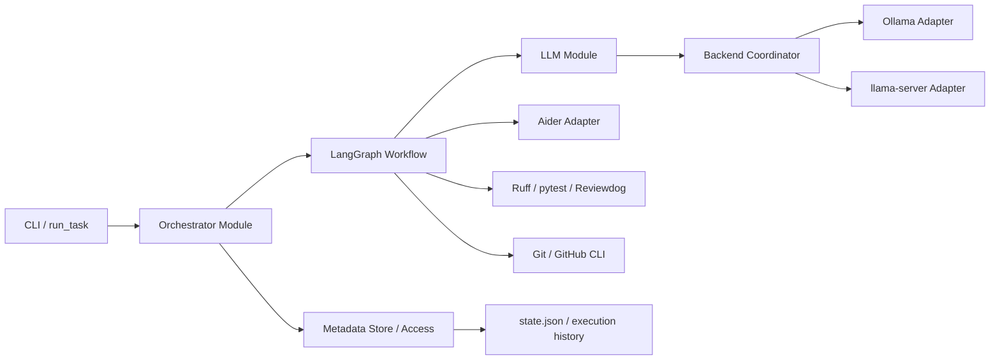
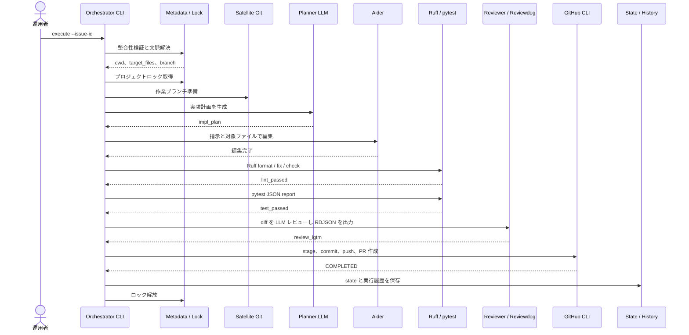
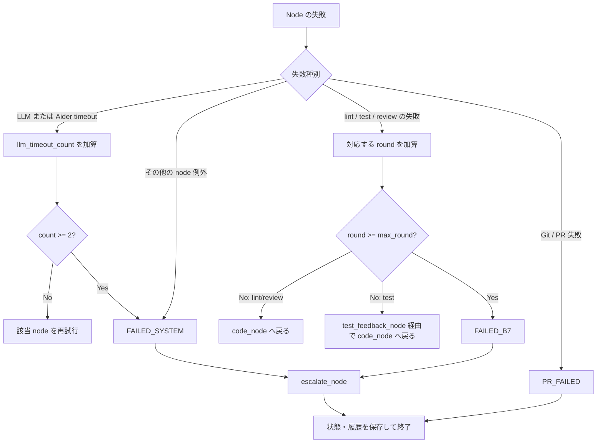

# 詳細設計書（コンポーネント詳細・データフロー・実装仕様）
**LangGraph / OpenAI 互換 API / Aider / Ruff / Reviewdog 統合実装仕様**

| 項目     | 内容                                                                                                  |
| :------- | :---------------------------------------------------------------------------------------------------- |
| 文書番号 | SBOS-DD-003                                                                                           |
| 版数     | Rev.6.0（コード修正追随および設計補強版）                                                             |
| 改訂日   | 2026年8月8日                                                                                          |
| 作成日   | 2026年7月28日                                                                                         |
| 実装正本 | `tools/`、`config/models.json`、`metadata/.project-registry.json`、`metadata/projects/<PROJECT_KEY>/` |
| 対象読者 | 実装担当エンジニア、運用担当者、テスト担当者                                                          |

---

## 1. 目的・適用範囲

本書は、衛星リポジトリの Issue を対象に、計画生成、コード編集、静的解析、テスト、LLM レビュー、PR 作成までを実行するオーケストレーターの詳細設計を定義する。実装の正本は本書ではなく `tools/` 配下のコードである。本書は、呼び出し側が知るべき Interface、状態遷移、不変条件、外部ツールとの seam、永続化・監査・運用上の制約を定義する。

対象は `orchestrator_graph.py` を中心とした実行基盤であり、衛星プロダクトの業務ロジック、優先度キャッシュの生成、モデル評価ツール `tools/model_test/eval_simpleqa.py` は対象外とする。

### 1.1 設計原則

- **実装正本**: Module の振る舞い・引数・例外は実装コードを正とし、本書では実装を複製しない。
- **隔離**: 母艦のメタデータ（Metadata Store）と衛星リポジトリを分離し、衛星内の Git 操作は解決済み `cwd` でのみ行う。
- **明示的な route**: LLM の intent は `config/models.json` の route でプロファイルへ明示的に対応付ける。
- **fail-safe**: プロジェクト文脈、Git、LLM、品質ゲートの例外は状態・履歴へ記録し、安全に停止する。
- **最小権限**: Aider の編集対象と Git の stage 対象は `target_files` を基準に制限する。ただし実装上の拡張規則は §10 に記載する。

## 2. 全体アーキテクチャ



### 2.1 Module と Interface

| Module                   | Interface                                        | 責務                                                                   |
| :----------------------- | :----------------------------------------------- | :--------------------------------------------------------------------- |
| `orchestrator_graph.py`  | `execute_issue()`、`cmd_orchestrate()`、`main()` | 実行前検証、ロック、Git ブランチ準備、LangGraph 実行、状態・履歴保存。 |
| `config_loader.py`       | `load_model_config()`、各 `get_*_config()`       | Pydantic による設定検証と設定値の提供。                                |
| `llm_client.py`          | `call_llm()`                                     | role・intent・設定から OpenAI 互換 API 呼び出しを構成。                |
| `backend_coordinator.py` | `BackendExecutionCoordinator.execute()`          | intent の profile 解決、GPU リース、Backend Adapter 選択。             |
| `llama_backend.py`       | `managed_llama_server()`                         | llama-server プロセスの起動、待機、終了、ポート解放確認。              |
| `aider_runner.py`        | `run_aider()`、`get_git_diff()`                  | Aider CLI 実行と Git 差分取得。                                        |
| `run_task.py`            | `clean_satellite_repository()`、`main()`         | 排他ロック保護下でのクリーンアップおよびオーケストレーター起動ラッパー。 |

## 3. 設定モデルとルーティング

LLM 関連設定の検証、Pydantic スキーマ、および intent に基づくプロファイルルーティングの詳細については、以下を参照すること。

👉 **[SBOS-DD-005_Backend_GPUリース仕様.md](file:///c:/Users/xzyoi/Desktop/python/second-brain-graph/docs/design/SBOS-DD-005_Backend_GPUリース仕様.md)**

## 4. プロジェクト・メタデータ設計

ディレクトリ構成、メタデータ形式の詳細については、以下を参照すること。

👉 **[SBOS-DD-007_永続化_排他制御仕様.md](file:///c:/Users/xzyoi/Desktop/python/second-brain-graph/docs/design/SBOS-DD-007_永続化_排他制御仕様.md)**

`resolve_project_context()` は順に `project.json.target_files`、`tasks.md` 内の Python パス、衛星内の Python ファイル探索から候補を得る。Issue 詳細ファイルに Target Files がある場合はそれを優先し、実在しない Python パスはファイル名の近似で衛星内ファイルへ補正する。衛星は `.git` が存在するディレクトリでなければ無効とする。

## 5. 実行ライフサイクル

### 5.1 実行開始前の契約

`execute_issue(issue_id, project_key, ..., resume=None, fresh=False)` は以下を順に実行する。

1. Issue ID とプロジェクトメタデータの整合性を検証する。
2. 衛星の `cwd`、対象ファイル、base branch、作業ブランチ prefix を解決する。無効な文脈では Aider を起動せず `FAILED_SYSTEM` を記録する。
3. `ProjectLockManager` で `metadata/projects/<PROJECT_KEY>/.lock` を取得する。競合時は `SKIPPED_LOCKED` と `LOCKED` を記録し、イベントファイルを作成して終了する。
4. Git ワークツリーを確認し、実行モードに応じて作業ブランチを準備する。
5. 初期 `GraphState` を生成して LangGraph を実行し、終了後に `state.json` と実行履歴を原子的に保存する。

### 5.2 Git ブランチ準備

| モード | 選択条件                                                                                   | 振る舞い                                                                                               |
| :----- | :----------------------------------------------------------------------------------------- | :----------------------------------------------------------------------------------------------------- |
| Resume | `--resume`、または既存 state が `CHANGES_REQUESTED`、`PR_FAILED`、`FAILED_B7`、`IN_REVIEW` | 既存作業ブランチへ switch し、base branch への rebase を試みる。未コミット差分は WIP commit を試みる。 |
| Fresh  | 上記以外、または `--fresh`                                                                 | base branch へ switch、`pull --ff-only`、既存の作業ブランチを削除し、base branch から再作成する。      |

通常の実行で dirty working tree が見つかった場合は停止する。`allow_offline_git=True` を指定したプログラム呼び出しだけが、base branch の pull 失敗後も継続できる。作業ブランチの初期名は `project.json.work_branch_prefix` または `sbos/` と Issue ID の結合である。

### 5.3 GraphState

`GraphState` は LangGraph 内部の共有状態であり、外部永続化スキーマではない。

| 区分           | フィールド                                                                                                                   |
| :------------- | :--------------------------------------------------------------------------------------------------------------------------- |
| 識別・文脈     | `issue_id`、`project_key`、`execution_id`、`generation`、`cwd`、`base_branch`、`target_files`、`instruction`                 |
| 制御・失敗     | `status`、`error`、`error_category`、`llm_timeout_count`、`lint_round`、`test_round`、`review_round`、`max_round`            |
| 生成・品質結果 | `impl_plan`、`aider_message`、`test_feedback_instruction`、`lint_result`、`test_result`、`review_verdict`、`review_comments` |
| 監査結果       | `review_rounds`、`rdjson`、`reviewdog_result`、`history_summary`                                                             |

初期状態は `status='running'`、各 round と `llm_timeout_count` は 0、`max_round` は 3 とする。`TypedDict` は実行時検証を行わないため、各 node は存在しない任意値を `get()` または `setdefault()` で扱う。

#### Status taxonomy

| 区分                   | status                                                                   | 役割・意味                                                                 |
| :--------------------- | :----------------------------------------------------------------------- | :------------------------------------------------------------------------- |
| 実行中・中間状態       | `running`、`code_completed`、`lint_passed`、`test_passed`、`review_lgtm` | LangGraph のノード間を遷移する進行中状態。                                 |
| 再試行指示             | `retry_spec_draft`、`retry_code`、`retry_review`                         | 各ノード（品質判定やタイムアウト）からの再実行シグナル。                    |
| 終端・成功             | `COMPLETED`                                                              | PR 作成または既存 PR 検出により正常完了した終端状態。                      |
| 終端・失敗/エスカレーション | `FAILED_SYSTEM`、`FAILED_B7`、`ESCALATED_NEEDS_REVISION`、`PR_FAILED`、`SKIPPED_LOCKED` | ロック競合、システムエラー、品質上限超過、PR 失敗等の終端状態。            |

この分類は文書上の整理であり、現行実装では `status` は任意文字列 (`str`) として保持される。実装自体は安定稼働しているため即時の全面書き換えは不要だが、次回以降のリファクタリングにおいて Python の `Literal` または `Enum` として型安全に厳密化する。新しい status を追加する際は、§5.5 の遷移表、`state.json`、実行履歴、統合テストを同時に更新する。

### 5.4 正常系シーケンス

正常系では、品質検証とレビューが1回で完了する。再試行・例外は §5.5 と §5.6 を参照する。



### 5.5 状態遷移表

| 実行 node            | 成功時の status と次 node                                         | 再試行時の status と次 node                          | 終端・停止                                      |
| :------------------- | :---------------------------------------------------------------- | :--------------------------------------------------- | :---------------------------------------------- |
| `spec_draft_node`    | `running` → `code_node`                                           | `retry_spec_draft` → 同 node                         | `FAILED_SYSTEM` → `escalate_node`               |
| `code_node`          | `code_completed` → `lint_node`                                    | `retry_code` → 同 node                               | `FAILED_SYSTEM` → `escalate_node`               |
| `lint_node`          | `lint_passed` → `test_node`                                       | `retry_code` → `code_node`                           | `FAILED_B7` / `FAILED_SYSTEM` → `escalate_node` |
| `run_pytest_node`    | `test_passed` → `review_node`                                     | テスト失敗 → `test_feedback_node`                    | `FAILED_B7` / `FAILED_SYSTEM` → `escalate_node` |
| `test_feedback_node` | `retry_code` → `code_node`                                        | —                                                    | `FAILED_SYSTEM` → `escalate_node`               |
| `review_node`        | `review_lgtm` → `done_node`                                       | `retry_review` → 同 node、`retry_code` → `code_node` | `FAILED_B7` / `FAILED_SYSTEM` → `escalate_node` |
| `done_node`          | `COMPLETED` → 終了                                                | —                                                    | `PR_FAILED` → 終了                              |
| `escalate_node`      | `FAILED_B7` / `FAILED_SYSTEM` / `ESCALATED_NEEDS_REVISION` → 終了 | —                                                    | —                                               |

### 5.6 例外・再試行フロー



`llm_timeout_count` は planner、Aider、reviewer 間で共有される。異なる node の timeout も合算され、2回目で `FAILED_SYSTEM` となる。`escalate_node` は lint または test の上限到達時に敗因レポートの生成を試み、成功時は最終 status を `ESCALATED_NEEDS_REVISION` に更新する。

### 5.7 Node 契約

| Node                 | 成功時                                                                                                      | 再試行・エスカレーション                                                                               |
| :------------------- | :---------------------------------------------------------------------------------------------------------- | :----------------------------------------------------------------------------------------------------- |
| `spec_draft_node`    | planner の出力を `impl_plan` へ保存する。                                                                   | timeout は初回 `retry_spec_draft`、2回目は `FAILED_SYSTEM`。その他例外は `SYSTEM_ERROR`。              |
| `code_node`          | Aider 実行後、`.gitignore` の変更を戻し、Git 状態から変更済み Python ファイルを `target_files` に追加する。 | timeout は初回 `retry_code`、2回目は `FAILED_SYSTEM`。その他の Aider エラーは即時 `SYSTEM_ERROR`。     |
| `lint_node`          | 対象 Python がなければ `lint_passed`。Ruff の最終 check 成功で `lint_passed`。                              | 失敗時は `LINT_ERROR` と `lint_round` を更新し、3回目で `FAILED_B7`。                                  |
| `run_pytest_node`    | pytest の JSON report を解析し、成功なら `test_passed`。                                                    | 失敗時は `TEST_ERROR` と `test_round` を更新し、3回目で `FAILED_B7`。実行・解析例外は `SYSTEM_ERROR`。 |
| `test_feedback_node` | reasoning LLM の助言を `test_feedback_instruction` と `aider_message` に保存する。                          | 助言作成失敗時も raw テスト出力を維持して `retry_code`。                                               |
| `review_node`        | LLM 判定、構造化コメント、RDJSON、レビュー履歴を保存する。                                                  | timeout は初回 `retry_review`、2回目は `FAILED_SYSTEM`。指摘は最大3回まで `retry_code`。               |
| `done_node`          | 対象ファイルを stage・commit・push し PR を作成、または既存 PR を検出して `COMPLETED`。                     | Git/PR 操作失敗は `PR_FAILED` / `PR_ERROR`。                                                           |
| `escalate_node`      | 最終状態を防御的に `FAILED_B7` または `FAILED_SYSTEM` とする。                                              | lint/test の上限到達時は敗因レポート生成を試み、成功時は `ESCALATED_NEEDS_REVISION` とする。           |

## 6. 外部ツール Adapter 契約

### 6.1 LLM Adapter & Backend Coordinator

LLMへのリクエスト構成、OpenAI互換APIエンドポイントの切り替え、およびGPUリソースのリース制御の詳細については、以下を参照すること。

👉 **[SBOS-DD-005_Backend_GPUリース仕様.md](file:///c:/Users/xzyoi/Desktop/python/second-brain-graph/docs/design/SBOS-DD-005_Backend_GPUリース仕様.md)**

### 6.2 Aider Adapter

Aider の起動オプション、一時ファイル制御、モデル解決、フェイルセーフ仕様の詳細については、以下を参照すること。

👉 **[SBOS-DD-004_詳細設計書.md](file:///c:/Users/xzyoi/Desktop/python/second-brain-graph/docs/design/SBOS-DD-004_詳細設計書.md)**

### 6.3 品質・レビュー Adapter

Ruff (lint)、pytest (test)、LLM レビューおよび Reviewdog の詳細仕様とエスカレーション処理については、以下を参照すること。

👉 **[SBOS-DD-006_品質ゲート_レビュー仕様.md](file:///c:/Users/xzyoi/Desktop/python/second-brain-graph/docs/design/SBOS-DD-006_品質ゲート_レビュー仕様.md)**

### 6.6 Git・PR Adapter

`done_node` は次の順序を守る。

1. 既存 staged 変更を拒否する。
2. `target_files` のみを `git add --` し、stage 後のファイル集合が対象外を含まないことを検証する。
3. 未コミット差分があれば commit する。
4. `git fetch origin` 後、`git push --force-with-lease -u origin <head>` を実行する。
5. `gh pr list --head <head> --json number` で既存 PR を確認し、なければ `gh pr create` を実行する。

いずれかの Git または GitHub CLI 操作が失敗した場合、ブランチ・差分を巻き戻さず `PR_FAILED` と `PR_ERROR` を設定する。PR 作成に使用する head は現在 `sbos/<ISSUE_ID>` に固定されるため、`work_branch_prefix` を変更する場合は §12 の制約を確認すること。

## 7. 永続化・監査・排他制御

`state.json` および `execution_history.json` の永続化契約（fsync + 原子置換）、ならびに `ProjectLockManager` による排他制御（ロック取得・競合時の挙動）の詳細については、以下を参照すること。

👉 **[SBOS-DD-007_永続化_排他制御仕様.md](file:///c:/Users/xzyoi/Desktop/python/second-brain-graph/docs/design/SBOS-DD-007_永続化_排他制御仕様.md)**

## 8. CLI・運用 Interface

### 8.1 オーケストレーター CLI

```text
uv run python tools/orchestrator_graph.py orchestrate [--project-key <PROJECT_KEY>]
uv run python tools/orchestrator_graph.py execute --issue-id <ISSUE_ID> [--project-key <PROJECT_KEY>] [--resume] [--fresh]
```

| コマンド      | 契約                                                                                                                                                          |
| :------------ | :------------------------------------------------------------------------------------------------------------------------------------------------------------ |
| `orchestrate` | 既存の `tools/.cache/priority-cache.json` から `issues`、互換形式として `tasks` を読み、score 降順の上位3件を表示する。キャッシュ生成・Issue 実行は行わない。 |
| `execute`     | Issue ID の prefix から project key を補完し、整合性検証後に `execute_issue()` を呼ぶ。                                                                       |
| legacy 入口   | サブコマンドなしでも `--issue-id` と `--project-key` が両方指定される場合だけ実行する。                                                                       |

### 8.2 run_task ラッパー

`run_task.py` は衛星のクリーンアップと `orchestrator_graph.py execute` の起動を担当する別 Interface である。`--dry-run` は実行予定だけを出力し、`--resume` はクリーンアップを省略する。既定では `git checkout -f <base>`、`git reset --hard origin/<base>`、`git clean -fd` を実行するため、未コミット変更・未追跡ファイルを破棄する。運用者は破壊的操作を理解した上でのみ利用すること。

## 9. セキュリティ・安全性の不変条件と制約

| 項目             | 実装上の保証・制約位置づけ                                          |
| :--------------- | :------------------------------------------------------------------ |
| 母艦誤編集の防止 | 無効な台帳・衛星ディレクトリ・対象ファイルでは Graph を開始しない。 |
| 並行実行         | 同一 project key は `run_task.py` を含め `ProjectLockManager`（`.lock`）により排他する。 |
| LLM の実行先     | intent は route を経由し、未定義 intent は拒否する。                |
| Aider のコミット | `--no-auto-commits` を常に指定する。                                |
| Stage 前検証     | 既存 staged 変更を拒否し、`target_files` に含まれない stage 変更を拒否する（※Aider 後に追加された変更済み Python も検証対象）。 |
| レビューの差分   | Git diff が取得できない場合は review を失敗させる。                 |
| Reviewdog        | 補助的な表示であり、失敗しても品質判定は継続する。                  |
| 状態保存         | state と履歴は個別ロック・一時ファイル置換で保護する。              |

### 9.1 副作用一覧

システム全体における全コンポーネントの副作用を以下の表に集約する。

| 実行箇所              | 副作用                                                                 | 影響範囲           |
| :-------------------- | :--------------------------------------------------------------------- | :----------------- |
| `run_task.py`         | ロック取得後、checkout, hard reset, clean で変更・未追跡ファイルを破棄する。 | 衛星ワークツリー   |
| `get_git_diff()`      | `git add -N .` を実行して未追跡ファイルを差分対象へ登録する。          | 衛星 Git index     |
| `code_node()` / Aider | 対象ファイルを編集し、`.gitignore` の変更を戻す。                      | 衛星ワークツリー   |
| `lint_node()`         | Ruff format と `--unsafe-fixes` で対象 Python ファイルを修正する。     | 衛星ワークツリー   |
| `run_pytest_node()`   | `.report.json` を一時作成し、終了時に削除する。                        | 衛星ワークツリー   |
| `escalate_node()`     | lint/test の上限到達時に `FAILURE_REPORT_<ISSUE_ID>.md` を作成する。   | 衛星ワークツリー   |
| `done_node()`         | `target_files` を stage・commit・`push --force-with-lease` し、PR を作成する。 | 衛星 Git／リモート |

副作用を伴う Module の変更時は、対象、失敗時の保持・復元方針、関連テストをこの表と §12 に反映する。

## 10. 現行仕様の制約・既知の実装差異・課題整理

### 10.1 現行仕様の制約

以下は現行実装の動作として受け入れる制約である。

1. **自動 backend fallback はない。** `fallback` 設定は検証されるだけで、Coordinator は route に指定された profile だけを実行する。
2. **`target_files` は事前確定の不変条件ではない。** Aider 指示対象の制限および PR 前 stage 検証の対象として使われるが、Aider 実行後に発生した変更済み Python ファイルも自動追加される。
3. **Ruff はファイルを直接書き換える。** `--unsafe-fixes` を含むため、lint node は read-only の品質検査ではなくワークツリー変更を伴う。
4. **pytest-json-report が必須である。** プラグイン未導入時の fallback はない。対象テストが解決できない場合、ui/gui 名を除く既存テストを広く実行する。
5. **`run_task --resume --fresh` は相互排他ではない。** 両方指定時は resume の動作が優先される。
6. **通常実行の event は保存しない。** events ディレクトリへの記録が確認できるのはロック競合時である。
7. **設定変更はプロセス再起動で反映される。** `lru_cache` を利用しているため、常駐プロセス化しない現行 CLI 運用ではプロセス再起動が必要となる。

### 10.2 既知の実装不整合と改修状況

1. **`run_task.py` のロック非取得クリーンアップ【Rev.6.0 で改修済み】**
   - 以前はロック取得前に cleanup を実行していたが、`ProjectLockManager` 内で cleanup および orchestrator 呼び出しを行うよう修正。
2. **作業ブランチ prefix の不一致【Rev.6.0 で改修済み】**
   - PR 作成時（`done_node`）に `sbos/<ISSUE_ID>` がハードコードされていたが、`GraphState` で `work_branch_prefix` を保持し動的適用するよう修正。
3. **`GraphState` の `test_feedback_instruction` の初期値**
   - 型定義上必須だが初期 state では未設定である。各 node は `.get()` を使用するため実行時には支障ない。

### 10.3 要件決定が必要な事項

- **`target_files` の厳密な境界要件**: 今後 Aider による意図しない他ファイル変更を完全にブロックするため、事前許可リスト以外の変更をエラーとするか（厳密な不変条件）、現状の柔軟な追記を許容するかを決定する。
- **データ境界とログ・LLM 情報セキュリティ**: LLM に送信する Git diff・テストログ、および実行履歴や Failure Report に出力される内容について、機密データや個人情報を含む場合のマスキング処理・保存期間・送信境界ルールを定義する。

### 10.4 将来のリファクタリング候補

- **`status` の Enum / Literal 化**: 現行 `str` 保持から型安全な定義へ移行。
- **Metadata モジュールの独立分離**: `orchestrator_graph.py` 内のメタデータ操作関数群を独立した Metadata Store / Access モジュールとして切り出し。
- **`run_task.py` と CLI の責務整理**: 破壊的クリーンアップ機能と通常実行の連携のさらなる整理。

## 11. テスト・検証設計

| テスト                                         | 対応する Interface・契約                                                                                                             |
| :--------------------------------------------- | :----------------------------------------------------------------------------------------------------------------------------------- |
| `tests/test_orchestrator_aider_integration.py` | Issue/プロジェクト検証、文脈解決、timeout、状態遷移、Ruff・pytest、レビュー/RDJSON/Reviewdog、PR branch prefix、履歴、CLI、resume を統合検証する。 |
| `tests/test_aider_runner.py`                   | Git diff、初回 commit 前 fallback、Aider 引数・timeout・非ゼロ終了、一時ファイル削除、`/v1` 除去を検証する。                         |
| `tests/test_backend_coordinator.py`            | intent route、Ollama/llama-server Adapter、GPU リース、未定義 intent、Ollama 到達不能時の llama-server 起動を検証する。              |
| `tests/test_llm_client.py`                     | role 設定、OpenAI SDK へのパラメータ伝達、intent 補完を検証する。                                                                    |
| `tests/test_run_task.py`                       | ロック保護下でのクリーンアップ順、resume 時の skip、dry-run の非実行性を検証する。                                                   |

### 11.1 保証範囲

| 検証層            | 現在の保証（モックベース検証）                                                                          | 未保証・実環境接続が必要な検証（smoke test）                                                       |
| :---------------- | :------------------------------------------------------------------------------------------------------ | :------------------------------------------------------------------------------------------------- |
| Unit / 契約テスト | 設定解決、Aider 引数・例外、Backend route、LLM パラメータ、run_task のロック・分岐をモックで検証する。  | 実行ファイルのインストールや外部サービスの可用性。                                                 |
| 統合テスト        | LangGraph の状態遷移、監査保存、Git/PR の失敗正規化、レビュー結果の構造化を隔離環境とモックで検証する。 | 実 Git remote、実 GitHub PR、実 LLM (Ollama/llama-server) の応答品質。                             |
| 実環境 smoke test | 自動テストスイートには含まれない（分離運用）。                                                          | Ollama、Aider、Ruff、pytest、Reviewdog、GitHub CLI、リモート Git を実接続した最小 Issue の完走検証。 |

実環境 smoke test は、衛星リポジトリを破壊しない専用の一時 repository と Issue を用意して別の運用手順として実施する。

```bash
uv run pytest
uv run ruff check tools tests
```

## 12. 変更時の設計判断

- 新しい LLM 用途を追加する場合は、role・intent・route・profile・テストを同時に追加する。暗黙の model 選択を導入しない。
- 新しい終端状態を追加する場合は、Graph の route、`state.json`、実行履歴、運用手順、統合テストを同時に更新する。
- Git 操作を追加する場合は、衛星 `cwd`、対象ファイル制限、失敗時の差分保持、破壊的操作の有無をこの文書に記載する。
- 新しい外部ツールは、Module の Interface、例外変換、timeout、テスト用 seam を定義してから Graph node へ接続する。
- 本書にコード全文を複製しない。関数シグネチャ、状態遷移、永続化形式、外部コマンド契約の変更を伴う実装変更だけを追記・更新する。
