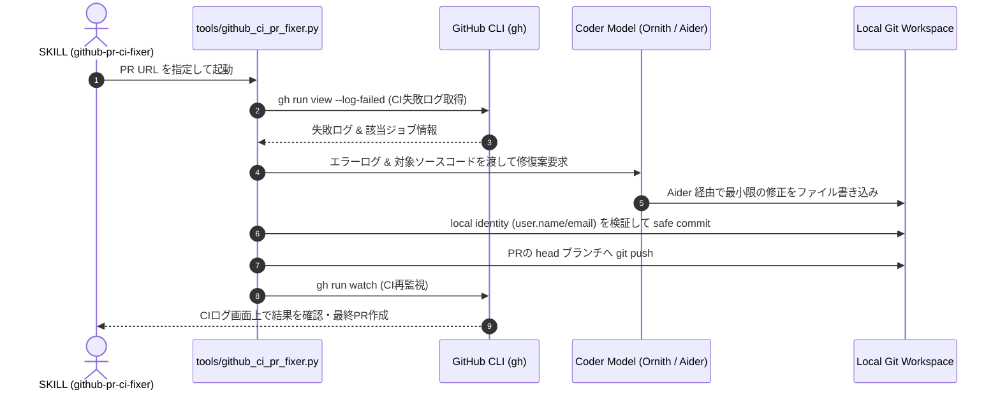

# Coderモデル動作検証仕様・実績および GitHub CI PR Fixer 設計書

- **作成日**: 2026-09-15
- **対象モデル**: `Ornith-1.5-9B-Q5_K_M.gguf` (`ornith-1.5-9b:latest`)
- **関連要件**: Issue #17 (自律コーダーエージェント必要要件) / `github-pr-ci-fixer` スキル

---

## 1. 概要

本ドキュメントは、ローカルLLM環境における自律コーダー（Coder）モデルの**実稼働検証（Live E2E Test）結果・留意事項**、および CI 失敗修復を専門とする**独立モジュール `github_ci_pr_fixer.py` のアーキテクチャ設計**をまとめたものである。

---

## 2. Coderモデル (`Ornith-1.5-9B`) 実稼働検証 (Coder Test)

### 2.1 モデル登録と構成
- **GGUFファイル**: `models/Ornith-1.5-9B-Q5_K_M.gguf` (約 6.64 GB)
- **登録コマンド**: `python tools/register_ollama_model.py models/Ornith-1.5-9B-Q5_K_M.gguf ornith-1.5-9b:latest`
- **設定ファイル**: `config/models.json` 内の `coding_ollama` プロファイルに `ornith-1.5-9b:latest` を割り当て。

### 2.2 実機（Live E2E）テスト結果
1. **Ollama API 直呼び出し (`call_llm`)**:
   - **結果**: **成功 (`PASSED`)**
   - **推論時間**: 約 66 秒
   - **出力精度**: Python 型ヒント (`a: int, b: int -> int:`) を含む正確なコードを出力。
2. **Aider CLI + Real Model による自動ファイル編集**:
   - **結果**: **成功 (`PASSED`)**
   - **テストフォーマット**: `whole`, `diff`, `udiff`, `editor-diff` の全4種で検証。
   - **挙動**: Aider が `ornith-1.5-9b:latest` からの指示ブロックを正しくパースし、対象ファイルを全フォーマットで正常に自動追記・更新・保存完了。

### 2.3 動作上の留意点と懸念事項
1. **作業ディレクトリ (CWD) と Git リポジトリルート**:
   - Aider は `.git` が存在する「Gitリポジトリルート」を自動判定して動作する。
   - Aider に渡す対象ファイル (`target_files`) は、CWD 内相対パスではなく**Gitリポジトリルートからの相対パス**として指定・解決すること。
2. **推論速度とタイムアウト管理**:
   - 1回の推論・編集に 約30秒〜1分 要するため、オーケストレーター側のタイムアウト値は長め（300秒〜1200秒）に維持する。
3. **大容量ファイルに対する `diff` 編集の制御**:
   - 100〜200行を超える大容量ファイルでは `diff` (SEARCH/REPLACE) ブロックの記述ハルシネーションが発生しやすいため、モジュール分割を推進しつつ `edit_format: "whole"` の利用を推奨する。

### 2.4 実務レベル GUI アプリケーション自動編集テスト項目 (`tests/test_coder_practical_gui.py`)
単なる簡易関数 (`add` や `hello world`) ではなく、エンタープライズ・実業務クラスの複雑な条件・状態管理・GUI連携を含むテストケースを追加・実証した。

1. **実務シナリオ 1: GUI フォーム検証・マルチスレッド非同期処理・進捗バー・例外ダイアログ**
   - **内容**: 既存の注文処理 GUI (`OrderProcessingApp`) に対し、非空・正数バリデーション、`threading.Thread` によるUIスレッド分離非同期処理、`ttk.Progressbar` のスレッドセーフ更新、`messagebox.showerror` によるエラー捕捉ダイアログの追加を Aider にリファクタリングさせた。
   - **検証結果**: **成功 (`PASSED` / 1分30秒)**。
2. **実務シナリオ 2: GUI データ可視化・キャンバス埋め込みと動的クリア (`Matplotlib`)**
   - **内容**: 既存のアナリティクスダッシュボードに対し、`FigureCanvasTkAgg` の埋め込み、描画領域のクリア (`ax.clear()`)、動的再描画 (`canvas.draw()`)、およびクリアボタンの連携ロジックを自律追加させるテスト。
3. **実務シナリオ 3: GUI 設定ファイル永続化・UIバインディング・入出力例外ハンドリング (`JSON Config`)**
   - **内容**: 設定ダイアログに対し、`json.load` / `json.dump` による設定読み込み・保存機能、Entryウィジェットへの初期化データバインド、および `FileNotFoundError` / `JSONDecodeError` の捕捉ダイアログ追加を自律実装させるテスト。

---

## 3. GitHub CI PR Fixer 独立モジュール設計

### 3.1 独立分離の理由 (Single Responsibility Principle)
- メインの [orchestrator_graph.py](file:///c:/Users/xzyoi/Desktop/python/second-brain-graph/tools/orchestrator_graph.py) は Issue 全体の計画・分解・タスク制御に集中させる。
- PR 単位での CI 失敗監視および最小修復ロジックは、独立スクリプト `tools/github_ci_pr_fixer.py` に分離し、コードの複雑化を防ぐ。

### 3.2 アーキテクチャと連携フロー

### 3.3 CI実行・ログ保持のメリット
- **CI画面でのビジュアルログ**: GitHub Actions 上で失敗〜再実行の全ビルドログが記録され、人間による透明なレビュー・監査性が担保される。
- **安全制約の遵守**: `main`/`master` への直接 push 禁止、`force push` 禁止、ローカル Identity のみの利用を厳格に保持。

---

## 4. 今後のロードマップ
1. **Coderテストの拡充**: 様々なエラーケース（型エラー、構文エラー、ロジックバグ）に対する Aider + `ornith-1.5-9b:latest` の自動修復成功率の計測。
2. **`tools/github_ci_pr_fixer.py` の実装**: `SKILL.md` の制約に準拠した独立CLIツールの作成。
